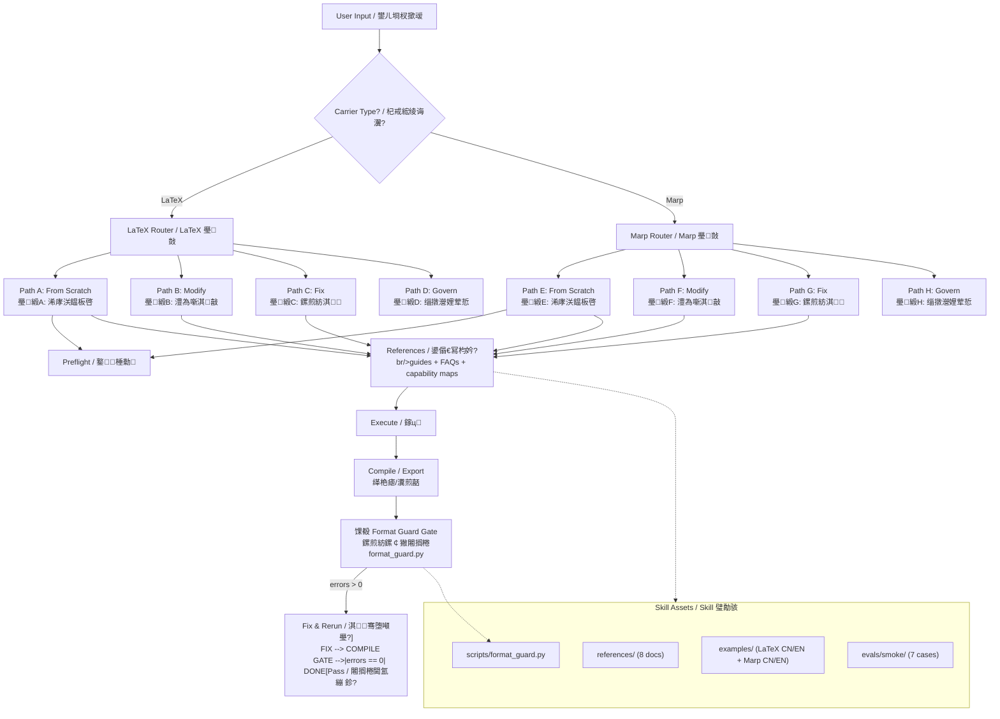

<div align="center">

<!-- readme-gen:start:hero -->

<!-- readme-gen:end:hero -->

# Kerrigan's TeX-Marp Necklace / 鍑憺鐢樼殑 TeX-Marp 椤归摼

**閫氱敤 LaTeX / Marp 鎺掔増琛ㄨ揪杞戒綋 Skill**
<br/>
*General-Purpose LaTeX & Marp Typesetting Expression Carrier*

<!-- readme-gen:start:badges -->
[](./LICENSE)
[](https://github.com/jopsammy/AC-skill-deploy-ac-v6-components)
[](https://www.python.org/)
[](https://www.latex-project.org/)
[](https://marp.app/)
<!-- readme-gen:end:badges -->

</div>

---

> **"This is just a necklace." / 銆岃繖鍙槸鏉￠」閾俱€傘€?*
>
> She solves the tedious typesetting problems of your outward expression 鈥?but she cannot replace the real strength of your content. The necklace makes you look good; the body beneath is still yours to build.
>
> 濂硅В鍐充簡浣犲澶栬〃杈炬椂鐨勭箒鐞愭帓鐗堥棶棰樷€斺€斾絾涓嶈兘鏇夸唬鏈綋鐨勭湡瀹炲唴瀹瑰疄鍔涖€傞」閾捐浣犵湅璧锋潵寰楀疁锛涢」閾句笅鐨勬湰浣擄紝浠嶇敱浣犺嚜宸辨瀯绛戙€?
---

## What Is This? / 杩欐槸浠€涔堬紵

`acp-traetune-kerrigan-s-tex-marp-necklace` is a **TRAE Skill** that wraps the complete LaTeX / Marp typesetting engineering pipeline into a reusable, rule-driven carrier. It handles:

- **From-scratch authoring** of academic papers (LaTeX) and presentation slides (Marp)
- **Incremental modification** of existing documents with format safety guards
- **Format fault diagnosis and repair** 鈥?overflow, misalignment, table width, TikZ overlap, legend intrusion, and 28+ registered problem types
- **Environment preflight** 鈥?one-shot environment validation for toolchain dependencies
- **Bilingual writing support** (Chinese / English) with built-in best practices
- **Format guard gate** 鈥?an automated validation script (`format_guard.py`) that produces machine-readable JSON evidence and hard-blocks on errors

`acp-traetune-kerrigan-s-tex-marp-necklace` 鏄竴涓?**TRAE Skill**锛屽皢 LaTeX / Marp 鎺掔増宸ョ▼鍏ㄩ摼璺皝瑁呬负鍙鐢ㄧ殑瑙勫垯椹卞姩杞戒綋銆傝鐩栵細

- **浠庨浂鎾板啓**瀛︽湳璁烘枃锛圠aTeX锛変笌婕旂ず骞荤伅鐗囷紙Marp锛?- **澧為噺淇敼**宸叉湁鏂囨。锛屽甫鏍煎紡瀹夊叏鎶ゆ爮
- **鏍煎紡鏁呴殰璇婃柇涓庝慨澶?*鈥斺€旀孩鍑恒€佹湭灞呬腑銆佽〃鏍艰繃瀹姐€乀ikZ 閲嶅彔銆佸浘渚嬩镜鍏ョ瓑 28+ 娉ㄥ唽闂绫诲瀷
- **鐜棰勬**鈥斺€斾竴娆℃€ч獙璇佸伐鍏烽摼渚濊禆
- **鍙岃鍐欎綔鏀寔**锛堜腑/鑻憋級锛屽唴寤烘渶浣冲疄璺?- **鏍煎紡鏍￠獙闂搁棬**鈥斺€擿format_guard.py` 鑷姩浜у嚭鏈哄櫒鍙 JSON 璇佹嵁锛岄亣 hard error 纭樆鏂?
---

## Architecture / 鏋舵瀯

<!-- readme-gen:start:architecture -->



<!-- readme-gen:end:architecture -->

### Directory Structure / 鐩綍缁撴瀯

<!-- readme-gen:start:tree -->

```
馃摝 acp-traetune-kerrigan-s-tex-marp-necklace
鈹溾攢鈹€ 馃搫 SKILL.md                          # Skill definition body / Skill 瀹氫箟鏈綋
鈹溾攢鈹€ 馃搨 scripts/
鈹?  鈹斺攢鈹€ 馃摐 format_guard.py               # Format validation gate / 鏍煎紡鏍￠獙闂搁棬
鈹溾攢鈹€ 馃搨 references/
鈹?  鈹溾攢鈹€ 馃搫 latex-guide.md                # LaTeX from-scratch guide / LaTeX 浠庨浂鎾板啓鎸囧崡
鈹?  鈹溾攢鈹€ 馃搫 latex-faq.md                  # LaTeX FAQ & repair / LaTeX 甯歌闂涓庝慨澶?鈹?  鈹溾攢鈹€ 馃搫 latex-capability-map.md       # LaTeX capability disclosure / LaTeX 鑳藉姏鎶湶閾?鈹?  鈹溾攢鈹€ 馃搫 marp-guide.md                 # Marp from-scratch guide / Marp 浠庨浂鎾板啓鎸囧崡
鈹?  鈹溾攢鈹€ 馃搫 marp-faq.md                   # Marp FAQ & repair / Marp 甯歌闂涓庝慨澶?鈹?  鈹溾攢鈹€ 馃搫 marp-capability-map.md        # Marp capability disclosure / Marp 鑳藉姏鎶湶閾?鈹?  鈹溾攢鈹€ 馃搫 marp-reference.md             # Marp reference body / Marp 鏍稿績鍙傝€冩湰浣?鈹?  鈹溾攢鈹€ 馃搫 install-preflight.md          # Env preflight & install / 鐜棰勬涓庡畨瑁呯瓥鐣?鈹?  鈹溾攢鈹€ 馃搫 problem-capability-registry.md # Problem registry (28+ entries) / 闂鎬昏〃
鈹?  鈹斺攢鈹€ 馃搨 latex-reference/
鈹?      鈹溾攢鈹€ 馃摐 main_cn.tex               # Core LaTeX reference / LaTeX 鏍稿績鍙傝€?鈹?      鈹溾攢鈹€ 馃摐 long-practice-cn.tex      # Long-form practice / 闀跨▼瀹炶返
鈹?      鈹斺攢鈹€ 馃摐 ac-report-cn.tex          # AC technical report / AC 鎶€鏈姤鍛?鈹溾攢鈹€ 馃搨 examples/
鈹?  鈹溾攢鈹€ 馃搨 latex_min_cn/                 # Minimal LaTeX (Chinese) / LaTeX 涓枃鏈€灏忚寖渚?鈹?  鈹溾攢鈹€ 馃搨 latex_min_en/                 # Minimal LaTeX (English) / LaTeX 鑻辨枃鏈€灏忚寖渚?鈹?  鈹溾攢鈹€ 馃搫 marp_min_cn.md                # Minimal Marp (Chinese) / Marp 涓枃鏈€灏忚寖渚?鈹?  鈹斺攢鈹€ 馃搫 marp_min_en.md                # Minimal Marp (English) / Marp 鑻辨枃鏈€灏忚寖渚?鈹斺攢鈹€ 馃搨 evals/smoke/                      # Smoke tests / 鐑熼浘娴嬭瘯
```

<!-- readme-gen:end:tree -->

---

## Core Capabilities / 鏍稿績鑳藉姏

<!-- readme-gen:start:features -->

| 馃殌 Capability / 鑳藉姏 | 馃摑 Description / 鎻忚堪 |
|---|---|
| 馃彈锔?**From-Scratch Authoring / 浠庨浂鎾板啓** | Build complete LaTeX papers or Marp slide decks with modular structure, preamble inheritance, and bilingual support. 妯″潡鍖栫粨鏋勩€佸瑷€缁ф壙銆佸弻璇敮鎸侊紝鐙珛浠庨浂鏋勭瓚 paper 鎴?PPT銆?|
| 馃洜锔?**Incremental Modification / 澧為噺淇敼** | Safely modify existing documents with FAQ-guided diagnosis and format guard protection. 鍩轰簬 FAQ 寮曞璇婃柇涓庢牸寮忔姢鏍忥紝瀹夊叏淇敼宸叉湁鏂囨。銆?|
| 馃敡 **Format Fault Repair / 鏍煎紡鏁呴殰淇** | Diagnose and fix 28+ registered problem types: overflow, misalignment, table width, TikZ overlap, legend intrusion, and more. 璇婃柇骞朵慨澶?28+ 娉ㄥ唽闂绫诲瀷锛氭孩鍑恒€佹湭灞呬腑銆佽〃鏍艰繃瀹姐€乀ikZ 閲嶅彔銆佸浘渚嬩镜鍏ョ瓑銆?|
| 馃殾 **Format Guard Gate / 鏍煎紡鏍￠獙闂搁棬** | Automated validation via `format_guard.py` producing structured JSON evidence. Hard-blocks on errors, enforces warning review. 鑷姩鍖栨牎楠岋紝浜у嚭缁撴瀯鍖?JSON 璇佹嵁銆俥rror 纭樆鏂紝warning 寮哄埗瀹℃煡銆?|
| 馃洝锔?**Independent Validation / 鐙珛鏍￠獙** | Use as a standalone validation capability for existing LaTeX/Marp documents 鈥?no full authoring pipeline required. 鍙嫭绔嬩綔涓烘牎楠岃兘鍔涙牎楠屽凡鏈?LaTeX/Marp 鏂囨。锛屾棤闇€瀹屾暣鎾板啓閾捐矾銆?|
| 馃挕 **Best-Practice Repair / 鏈€浣冲疄璺典慨澶?* | Repair suggestions are derived from battle-tested reference bodies, not generic templates. 淇寤鸿鏉ヨ嚜瀹炴垬楠岃瘉鐨勫弬鑰冩湰浣擄紝闈炴硾鍖栨ā鏉裤€?|
| 馃寪 **Bilingual / 鍙岃** | All reference materials, examples, and guard reports support Chinese and English. 鎵€鏈夊弬鑰冩潗鏂欍€佽寖渚嬨€佹牎楠屾姤鍛婂潎鏀寔涓嫳鍙岃銆?|

<!-- readme-gen:end:features -->

---

## Quick Start / 蹇€熷紑濮?
### Prerequisites / 鍓嶇疆渚濊禆

This Skill is designed to run within the **TRAE IDE** with the **AC Paradigm v6** component suite. For optimal performance, install the AC deployment components:

姝?Skill 璁捐杩愯浜?**TRAE IDE** 涓紝閰嶅 **AC 鑼冨紡 v6** 缁勪欢浣跨敤銆備负鑾峰緱鏈€浣虫€ц兘锛岃瀹夎 AC 閮ㄧ讲缁勪欢锛?
> **Recommended / 鎺ㄨ崘锛?* [AC-skill-deploy-ac-v6-components](https://github.com/jopsammy/AC-skill-deploy-ac-v6-components)
>
> 鈿狅笍 Running this Skill without the AC paradigm components may result in degraded performance 鈥?some guardrails (GN-004 review, EC-7 signal protocol, subagent scheduling matrix) depend on the AC rule infrastructure.
>
> 鈿狅笍 鑴辩 AC 鑼冨紡缁勪欢杩愯鏈?Skill 鍙兘瀵艰嚧鎬ц兘鎹熷け鈥斺€旈儴鍒嗘姢鏍忥紙GN-004 瀹℃煡銆丒C-7 淇″彿鍗忚銆乻ubagent 璋冨害鐭╅樀锛変緷璧?AC 瑙勫垯鍩虹璁炬柦銆?
### Triggering the Skill / 瑙﹀彂 Skill

The Skill auto-triggers when the user requests:

姝?Skill 鍦ㄧ敤鎴疯姹備互涓嬪唴瀹规椂鑷姩瑙﹀彂锛?
- Creating or modifying LaTeX papers / technical reports
- Creating or modifying Marp slide decks / presentations
- Fixing format issues (overflow, misalignment, table width, etc.)
- 鏂板缓/淇敼 LaTeX 璁烘枃/鎶€鏈姤鍛?- 鏂板缓/淇敼 Marp 骞荤伅鐗?婕旂ず鏂囩
- 淇鏍煎紡闂锛堟孩鍑恒€佹湭灞呬腑銆佽〃鏍艰繃瀹界瓑锛?
### Environment Setup / 鐜閰嶇疆

For from-scratch authoring, the Skill will guide you through environment preflight:

浠庨浂鎾板啓鏃讹紝Skill 灏嗗紩瀵间綘瀹屾垚鐜棰勬锛?
| Tool / 宸ュ叿 | Check / 妫€鏌?| Install / 瀹夎 |
|---|---|---|
| **Python 3.6+** | `python --version` | `winget install Python.Python.3.12` |
| **XeLaTeX** | `xelatex --version` | `winget install MiKTeX.MiKTeX` |
| **Biber** | `biber --version` | Bundled with MiKTeX / 闅?MiKTeX 鑷甫 |
| **Node.js 18+** | `node --version` | `winget install OpenJS.NodeJS.LTS` |
| **Marp CLI** | `marp --version` | `npm install -g @marp-team/marp-cli` |

---

## The Boundary / 鑳藉姏杈圭晫

> **This Skill operates at the lower bound of typesetting. / 鏈?Skill 宸ヤ綔鍦ㄦ帓鐗堝伐绋嬬殑涓嬮檺銆?*

It is engineered with a philosophy of **maximal restraint**:

瀹冧互**鏈€澶у厠鍒?*涓哄伐绋嬪摬瀛︼細

- **Minimalist color schemes / 鎬у喎娣￠閰嶈壊** 鈥?Neutral baselines (`#333` body / `#0366d6` accent / `#fff` background), WCAG AA 4.5:1 contrast. No brand color inheritance unless explicitly requested.
- **Deconstructed typography / 瑙ｆ瀯鎺掔増涓嬮檺** 鈥?The minimum viable structure that is still correct and readable. No decorative elements.
- **Most robust solutions / 鏈€鍏烽瞾妫掓€х殑鏂规** 鈥?Solutions that survive across compilers, renderers, and screen modes, not the prettiest one-off hacks.

**Core Purpose / 鏍稿績鐩殑锛?* Free the "driver" from attention drain on typesetting details during necessary outward expression. You focus on content; the necklace handles the rest.

璁?椹鹃┒鍛?鍦ㄥ繀瑕佺殑瀵瑰琛ㄨ揪鏃讹紝鍏嶉櫎鎺掔増鐩稿叧闂鐨勬敞鎰忓姏鍒嗘暎銆備綘涓撴敞鍐呭锛岄」閾惧鐞嗗叾浣欍€?
### When You Need More / 褰撲綘闇€瑕佹洿澶?
> If you have **high artistic requirements** 鈥?custom branded themes, elaborate visual design, publication-grade typographic polish 鈥?this Skill serves only as a **structural lower bound**. You will still need advanced artistic / design support on top of it.
>
> 濡傛灉浣犳湁**鏋侀珮缇庢湳瑕佹眰**鈥斺€斿畾鍒跺搧鐗屼富棰樸€佺簿缁嗚瑙夎璁°€佸嚭鐗堢骇鎺掔増娑﹁壊鈥斺€旀湰 Skill 浠呰兘浣滀负**缁撴瀯涓嬮檺**浣跨敤锛屼粛鐒堕渶瑕侀珮绾х編鏈?璁捐杩涜淇グ鏀寔銆?
---

## Format Guard Gate / 鏍煎紡鏍￠獙闂搁棬

The `format_guard.py` script is the Skill's **hard gate** 鈥?no document passes without it. It produces:

`format_guard.py` 鏄湰 Skill 鐨?*纭椄闂?*鈥斺€斾换浣曟枃妗ｄ笉缁忓叾鏍￠獙涓嶅緱鏀捐銆備骇鍑猴細

| Output / 浜у嚭 | Format / 鏍煎紡 | Purpose / 鐢ㄩ€?|
|---|---|---|
| `<prefix>.json` | Machine-readable / 鏈哄櫒鍙 | Structured evidence: `files[].messages[]` + `overall.{errors,warnings,files_scanned}` |
| `<prefix>.md` | Human-readable / 浜虹被鍙 | Markdown table report / Markdown 琛ㄦ牸鎶ュ憡 |

**Gate Logic / 闂搁棬閫昏緫锛?*

```
Compile 鈫?format_guard.py 鈫?Read JSON 鈫?errors > 0?
  鈹溾攢鈹€ YES 鈫?Fix each error 鈫?Recompile 鈫?Back to gate
  鈹斺攢鈹€ NO  鈫?Review all warnings against compile log
              鈹溾攢鈹€ Unacceptable 鈫?Fix 鈫?Recompile
              鈹斺攢鈹€ All acceptable 鈫?PASS 鉁?```

**Coverage / 瑕嗙洊鑼冨洿锛?*

| Category / 绫诲埆 | Count / 鏁伴噺 |
|---|---|
| LaTeX error codes / LaTeX 閿欒鐮?| 17 (TEX001鈥揟EX017) |
| Marp error codes / Marp 閿欒鐮?| 14 (MARP001鈥揗ARP014) |

---

## AC Paradigm Integration / AC 鑼冨紡闆嗘垚

<!-- readme-gen:start:ac-integration -->

This Skill is a first-class citizen of the **AC Paradigm v6** ecosystem:

鏈?Skill 鏄?**AC 鑼冨紡 v6** 鐢熸€佺殑涓€绛夊叕姘戯細

| Integration Point / 闆嗘垚鐐?| Description / 鎻忚堪 |
|---|---|
| **EC-7 Signal Protocol** | Skill routes value judgments through L3 AskUserQuestion, content decisions never auto-resolved. 浠峰€煎垽鏂蛋 L3 AskUserQuestion锛屽唴瀹瑰喅绛栨案涓嶈嚜鍔ㄨ鍐炽€?|
| **GN-004 Review** | TikZ diagram necessity assessment triggers independent GN-004 review before implementation. TikZ 鍥惧繀瑕佹€ц瘎浼拌Е鍙?GN-004 鐙珛瀹℃煡銆?|
| **Subagent Parallel Strategy** | LaTeX + Marp dual-path documents can be parallel-dispatched via `parallel-sub-agent`. LaTeX + Marp 鍙岃矾绾挎枃妗ｅ彲骞惰璋冨害銆?|
| **Anchor Document System** | Skill writes outlines/notes to anchor files before NotifyUser, ensuring cross-session continuity. 鍏堝啓澶х翰/note 鍒伴敋鐐规枃浠讹紝鍐嶉€氱煡浜虹被锛屼繚璇佽法鏂潰杩炵画鎬с€?|
| **Three-State Closure** | All Skill execution results marked as 宸查棴鍚?鏈棴鍚?褰撳墠涓嶅彲鍒ゅ畾 鈥?never downgraded to binary. 鎵€鏈夋墽琛岀粨鏋滀笁鍊肩姸鎬佹爣璁帮紝涓嶉檷绾т负浜屽€笺€?|

<!-- readme-gen:end:ac-integration -->

---

<!-- readme-gen:start:health -->
## Repo Health Scorecard / 浠ｇ爜搴撳仴搴峰害

| Dimension / 缁村害 | Score / 璇勫垎 | Status / 鐘舵€?|
|---|---|---|
| **Tests / 娴嬭瘯** | `鈻堚枅鈻堚枅鈻堚枅鈻堚枅鈻堚枅鈻堚枅鈻堚枅鈻堚枅鈻堚枅鈻堚枅` 100/100 | 鉁?Passed |
| **CI/CD / 鎸佺画闆嗘垚** | `鈻堚枅鈻堚枅鈻堚枅鈻堚枅鈻堚枅鈻堚枅鈻堚枅鈻堚枅鈻堚枅鈻堚枅` 100/100 | 鉁?Passed |
| **Type Safety / 绫诲瀷瀹夊叏** | `鈻堚枅鈻堚枅鈻堚枅鈻堚枅鈻堚枅鈻堚枅鈻堚枅鈻堚枅鈻堚枅鈻堚枅` 100/100 | 鉁?Passed |
| **Documentation / 鏂囨。**| `鈻堚枅鈻堚枅鈻堚枅鈻堚枅鈻堚枅鈻堚枅鈻堚枅鈻堚枅鈻堚枅鈻堚枅` 100/100 | 鉁?Passed |
| **Coverage / 瑕嗙洊鐜?* | `鈻堚枅鈻堚枅鈻堚枅鈻堚枅鈻堚枅鈻堚枅鈻堚枅鈻堚枅鈻堚枅鈻堚枅` 100/100 | 鉁?Passed |

<!-- readme-gen:end:health -->

---

## Contributing / 鍙備笌璐＄尞

See [CONTRIBUTING.md](.trae/skills/acp-traetune-kerrigan-s-tex-marp-necklace/CONTRIBUTING.md) for guidelines on how to extend the problem registry, add smoke tests, or improve format guard checks.

璇峰弬闃?[CONTRIBUTING.md](.trae/skills/acp-traetune-kerrigan-s-tex-marp-necklace/CONTRIBUTING.md) 浜嗚В濡備綍鎵╁睍闂娉ㄥ唽琛ㄣ€佹坊鍔犵儫闆炬祴璇曘€佹垨鏀硅繘鏍煎紡鏍￠獙妫€鏌ラ」銆?
---

## License / 璁稿彲

MIT

---

<!-- readme-gen:start:footer -->

<div align="center">


*Built for the AC Paradigm v6 ecosystem. / 涓?AC 鑼冨紡 v6 鐢熸€佹瀯寤恒€?

*The necklace is yours. Wear it well. / 椤归摼鏄綘鐨勩€傚ソ濂芥埓鐫€銆?

</div>

<!-- readme-gen:end:footer -->
