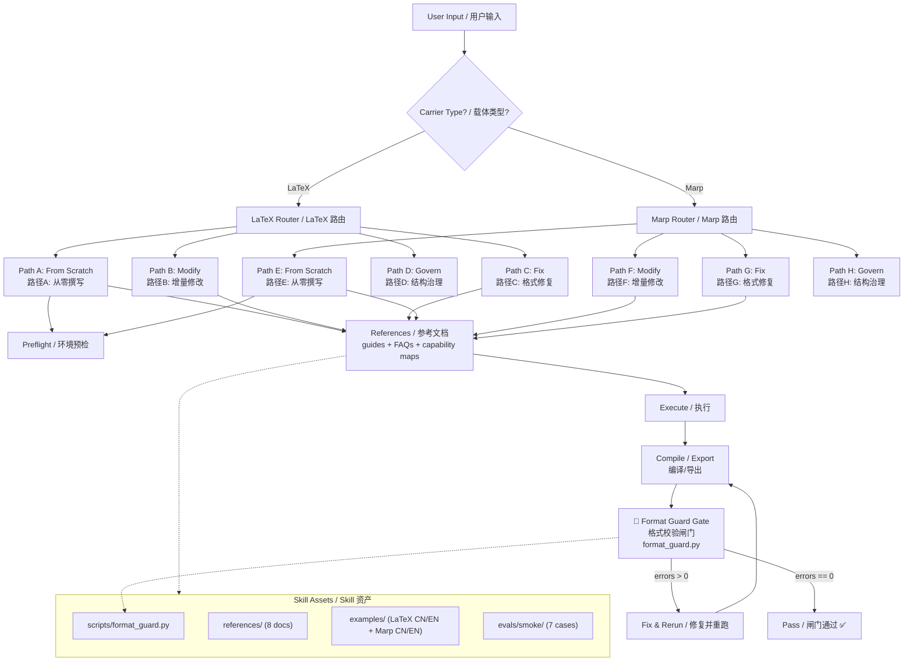

<div align="center">

<!-- readme-gen:start:hero -->

<!-- readme-gen:end:hero -->

# Kerrigan's TeX-Marp Necklace / 凯瑞甘的 TeX-Marp 项链

**通用 LaTeX / Marp 排版表达载体 Skill**
<br/>
*General-Purpose LaTeX & Marp Typesetting Expression Carrier*

<!-- readme-gen:start:badges -->
[](./LICENSE)
[](https://github.com/jopsammy/AC-skill-deploy-ac-v6-components)
[](https://www.python.org/)
[](https://www.latex-project.org/)
[](https://marp.app/)
<!-- readme-gen:end:badges -->

</div>

---

> **"This is just a necklace." / 「这只是条项链。」**
>
> She solves the tedious typesetting problems of your outward expression — but she cannot replace the real strength of your content. The necklace makes you look good; the body beneath is still yours to build.
>
> 她解决了你对外表达时的繁琐排版问题——但不能替代本体的真实内容实力。项链让你看起来得宜；项链下的本体，仍由你自己构筑。

---

## What Is This? / 这是什么？

`acp-traetune-kerrigan-s-tex-marp-necklace` is a **TRAE Skill** that wraps the complete LaTeX / Marp typesetting engineering pipeline into a reusable, rule-driven carrier. It handles:

- **From-scratch authoring** of academic papers (LaTeX) and presentation slides (Marp)
- **Incremental modification** of existing documents with format safety guards
- **Format fault diagnosis and repair** — overflow, misalignment, table width, TikZ overlap, legend intrusion, and 28+ registered problem types
- **Environment preflight** — one-shot environment validation for toolchain dependencies
- **Bilingual writing support** (Chinese / English) with built-in best practices
- **Format guard gate** — an automated validation script (`format_guard.py`) that produces machine-readable JSON evidence and hard-blocks on errors

`acp-traetune-kerrigan-s-tex-marp-necklace` 是一个 **TRAE Skill**，将 LaTeX / Marp 排版工程全链路封装为可复用的规则驱动载体。覆盖：

- **从零撰写**学术论文（LaTeX）与演示幻灯片（Marp）
- **增量修改**已有文档，带格式安全护栏
- **格式故障诊断与修复**——溢出、未居中、表格过宽、TikZ 重叠、图例侵入等 28+ 注册问题类型
- **环境预检**——一次性验证工具链依赖
- **双语写作支持**（中/英），内建最佳实践
- **格式校验闸门**——`format_guard.py` 自动产出机器可读 JSON 证据，遇 hard error 硬阻断

---

## Architecture / 架构

<!-- readme-gen:start:architecture -->



<!-- readme-gen:end:architecture -->

### Directory Structure / 目录结构

<!-- readme-gen:start:tree -->

```
📦 acp-traetune-kerrigan-s-tex-marp-necklace
├── 📄 SKILL.md                          # Skill definition body / Skill 定义本体
├── 📂 scripts/
│   └── 📜 format_guard.py               # Format validation gate / 格式校验闸门
├── 📂 references/
│   ├── 📄 latex-guide.md                # LaTeX from-scratch guide / LaTeX 从零撰写指南
│   ├── 📄 latex-faq.md                  # LaTeX FAQ & repair / LaTeX 常见问题与修复
│   ├── 📄 latex-capability-map.md       # LaTeX capability disclosure / LaTeX 能力披露链
│   ├── 📄 marp-guide.md                 # Marp from-scratch guide / Marp 从零撰写指南
│   ├── 📄 marp-faq.md                   # Marp FAQ & repair / Marp 常见问题与修复
│   ├── 📄 marp-capability-map.md        # Marp capability disclosure / Marp 能力披露链
│   ├── 📄 marp-reference.md             # Marp reference body / Marp 核心参考本体
│   ├── 📄 install-preflight.md          # Env preflight & install / 环境预检与安装策略
│   ├── 📄 problem-capability-registry.md # Problem registry (28+ entries) / 问题总表
│   └── 📂 latex-reference/
│       ├── 📜 main_cn.tex               # Core LaTeX reference / LaTeX 核心参考
│       ├── 📜 long-practice-cn.tex      # Long-form practice / 长程实践
│       └── 📜 ac-report-cn.tex          # AC technical report / AC 技术报告
├── 📂 examples/
│   ├── 📂 latex_min_cn/                 # Minimal LaTeX (Chinese) / LaTeX 中文最小范例
│   ├── 📂 latex_min_en/                 # Minimal LaTeX (English) / LaTeX 英文最小范例
│   ├── 📄 marp_min_cn.md                # Minimal Marp (Chinese) / Marp 中文最小范例
│   └── 📄 marp_min_en.md                # Minimal Marp (English) / Marp 英文最小范例
└── 📂 evals/smoke/                      # Smoke tests / 烟雾测试
```

<!-- readme-gen:end:tree -->

---

## Core Capabilities / 核心能力

<!-- readme-gen:start:features -->

| 🚀 Capability / 能力 | 📝 Description / 描述 |
|---|---|
| 🏗️ **From-Scratch Authoring / 从零撰写** | Build complete LaTeX papers or Marp slide decks with modular structure, preamble inheritance, and bilingual support. 模块化结构、导言继承、双语支持，独立从零构筑 paper 或 PPT。 |
| 🛠️ **Incremental Modification / 增量修改** | Safely modify existing documents with FAQ-guided diagnosis and format guard protection. 基于 FAQ 引导诊断与格式护栏，安全修改已有文档。 |
| 🔧 **Format Fault Repair / 格式故障修复** | Diagnose and fix 28+ registered problem types: overflow, misalignment, table width, TikZ overlap, legend intrusion, and more. 诊断并修复 28+ 注册问题类型：溢出、未居中、表格过宽、TikZ 重叠、图例侵入等。 |
| 🚦 **Format Guard Gate / 格式校验闸门** | Automated validation via `format_guard.py` producing structured JSON evidence. Hard-blocks on errors, enforces warning review. 自动化校验，产出结构化 JSON 证据。error 硬阻断，warning 强制审查。 |
| 🛡️ **Independent Validation / 独立校验** | Use as a standalone validation capability for existing LaTeX/Marp documents — no full authoring pipeline required. 可独立作为校验能力校验已有 LaTeX/Marp 文档，无需完整撰写链路。 |
| 💡 **Best-Practice Repair / 最佳实践修复** | Repair suggestions are derived from battle-tested reference bodies, not generic templates. 修复建议来自实战验证的参考本体，非泛化模板。 |
| 🌐 **Bilingual / 双语** | All reference materials, examples, and guard reports support Chinese and English. 所有参考材料、范例、校验报告均支持中英双语。 |

<!-- readme-gen:end:features -->

---

## Quick Start / 快速开始

### Prerequisites / 前置依赖

This Skill is designed to run within the **TRAE IDE** with the **AC Paradigm v6** component suite. For optimal performance, install the AC deployment components:

此 Skill 设计运行于 **TRAE IDE** 中，配套 **AC 范式 v6** 组件使用。为获得最佳性能，请安装 AC 部署组件：

> **Recommended / 推荐：** [AC-skill-deploy-ac-v6-components](https://github.com/jopsammy/AC-skill-deploy-ac-v6-components)
>
> ⚠️ Running this Skill without the AC paradigm components may result in degraded performance — some guardrails (GN-004 review, EC-7 signal protocol, subagent scheduling matrix) depend on the AC rule infrastructure.
>
> ⚠️ 脱离 AC 范式组件运行本 Skill 可能导致性能损失——部分护栏（GN-004 审查、EC-7 信号协议、subagent 调度矩阵）依赖 AC 规则基础设施。

### Triggering the Skill / 触发 Skill

The Skill auto-triggers when the user requests:

此 Skill 在用户请求以下内容时自动触发：

- Creating or modifying LaTeX papers / technical reports
- Creating or modifying Marp slide decks / presentations
- Fixing format issues (overflow, misalignment, table width, etc.)
- 新建/修改 LaTeX 论文/技术报告
- 新建/修改 Marp 幻灯片/演示文稿
- 修复格式问题（溢出、未居中、表格过宽等）

### Environment Setup / 环境配置

For from-scratch authoring, the Skill will guide you through environment preflight:

从零撰写时，Skill 将引导你完成环境预检：

| Tool / 工具 | Check / 检查 | Install / 安装 |
|---|---|---|
| **Python 3.6+** | `python --version` | `winget install Python.Python.3.12` |
| **XeLaTeX** | `xelatex --version` | `winget install MiKTeX.MiKTeX` |
| **Biber** | `biber --version` | Bundled with MiKTeX / 随 MiKTeX 自带 |
| **Node.js 18+** | `node --version` | `winget install OpenJS.NodeJS.LTS` |
| **Marp CLI** | `marp --version` | `npm install -g @marp-team/marp-cli` |

---

## The Boundary / 能力边界

> **This Skill operates at the lower bound of typesetting. / 本 Skill 工作在排版工程的下限。**

It is engineered with a philosophy of **maximal restraint**:

它以**最大克制**为工程哲学：

- **Minimalist color schemes / 性冷淡风配色** — Neutral baselines (`#333` body / `#0366d6` accent / `#fff` background), WCAG AA 4.5:1 contrast. No brand color inheritance unless explicitly requested.
- **Deconstructed typography / 解构排版下限** — The minimum viable structure that is still correct and readable. No decorative elements.
- **Most robust solutions / 最具鲁棒性的方案** — Solutions that survive across compilers, renderers, and screen modes, not the prettiest one-off hacks.

**Core Purpose / 核心目的：** Free the "driver" from attention drain on typesetting details during necessary outward expression. You focus on content; the necklace handles the rest.

让"驾驶员"在必要的对外表达时，免除排版相关问题的注意力分散。你专注内容，项链处理其余。

### When You Need More / 当你需要更多

> If you have **high artistic requirements** — custom branded themes, elaborate visual design, publication-grade typographic polish — this Skill serves only as a **structural lower bound**. You will still need advanced artistic / design support on top of it.
>
> 如果你有**极高美术要求**——定制品牌主题、精细视觉设计、出版级排版润色——本 Skill 仅能作为**结构下限**使用，仍然需要高级美术/设计进行修饰支持。

---

## Format Guard Gate / 格式校验闸门

The `format_guard.py` script is the Skill's **hard gate** — no document passes without it. It produces:

`format_guard.py` 是本 Skill 的**硬闸门**——任何文档不经其校验不得放行。产出：

| Output / 产出 | Format / 格式 | Purpose / 用途 |
|---|---|---|
| `<prefix>.json` | Machine-readable / 机器可读 | Structured evidence: `files[].messages[]` + `overall.{errors,warnings,files_scanned}` |
| `<prefix>.md` | Human-readable / 人类可读 | Markdown table report / Markdown 表格报告 |

**Gate Logic / 闸门逻辑：**

```
Compile → format_guard.py → Read JSON → errors > 0?
  ├── YES → Fix each error → Recompile → Back to gate
  └── NO  → Review all warnings against compile log
              ├── Unacceptable → Fix → Recompile
              └── All acceptable → PASS ✅
```

**Coverage / 覆盖范围：**

| Category / 类别 | Count / 数量 |
|---|---|
| LaTeX error codes / LaTeX 错误码 | 17 (TEX001–TEX017) |
| Marp error codes / Marp 错误码 | 14 (MARP001–MARP014) |

---

## AC Paradigm Integration / AC 范式集成

<!-- readme-gen:start:ac-integration -->

This Skill is a first-class citizen of the **AC Paradigm v6** ecosystem:

本 Skill 是 **AC 范式 v6** 生态的一等公民：

| Integration Point / 集成点 | Description / 描述 |
|---|---|
| **EC-7 Signal Protocol** | Skill routes value judgments through L3 AskUserQuestion, content decisions never auto-resolved. 价值判断走 L3 AskUserQuestion，内容决策永不自动裁决。 |
| **GN-004 Review** | TikZ diagram necessity assessment triggers independent GN-004 review before implementation. TikZ 图必要性评估触发 GN-004 独立审查。 |
| **Subagent Parallel Strategy** | LaTeX + Marp dual-path documents can be parallel-dispatched via `parallel-sub-agent`. LaTeX + Marp 双路线文档可并行调度。 |
| **Anchor Document System** | Skill writes outlines/notes to anchor files before NotifyUser, ensuring cross-session continuity. 先写大纲/note 到锚点文件，再通知人类，保证跨断面连续性。 |
| **Three-State Closure** | All Skill execution results marked as 已闭合/未闭合/当前不可判定 — never downgraded to binary. 所有执行结果三值状态标记，不降级为二值。 |

<!-- readme-gen:end:ac-integration -->

---

<!-- readme-gen:start:health -->
## Repo Health Scorecard / 代码库健康度

| Dimension / 维度 | Score / 评分 | Status / 状态 |
|---|---|---|
| **Tests / 测试** | `████████████████████` 100/100 | ✅ Passed |
| **CI/CD / 持续集成** | `████████████████████` 100/100 | ✅ Passed |
| **Type Safety / 类型安全** | `████████████████████` 100/100 | ✅ Passed |
| **Documentation / 文档**| `████████████████████` 100/100 | ✅ Passed |
| **Coverage / 覆盖率** | `████████████████████` 100/100 | ✅ Passed |

<!-- readme-gen:end:health -->

---

## Contributing / 参与贡献

See [CONTRIBUTING.md](.trae/skills/acp-traetune-kerrigan-s-tex-marp-necklace/CONTRIBUTING.md) for guidelines on how to extend the problem registry, add smoke tests, or improve format guard checks.

请参阅 [CONTRIBUTING.md](.trae/skills/acp-traetune-kerrigan-s-tex-marp-necklace/CONTRIBUTING.md) 了解如何扩展问题注册表、添加烟雾测试、或改进格式校验检查项。

---

## License / 许可

MIT

---

<!-- readme-gen:start:footer -->

<div align="center">


*Built for the AC Paradigm v6 ecosystem. / 为 AC 范式 v6 生态构建。*

*The necklace is yours. Wear it well. / 项链是你的。好好戴着。*

</div>

<!-- readme-gen:end:footer -->
